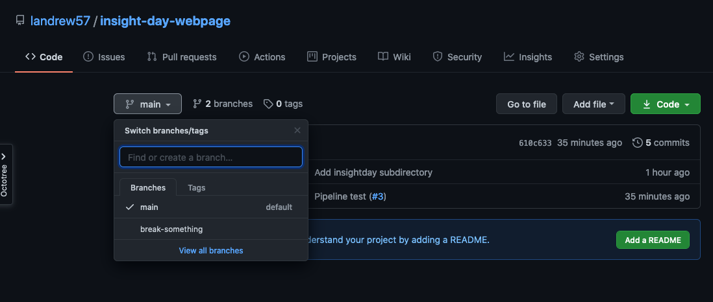

# Insight Day Feb 2021

## Broken pipeline
Someone has committed some bad code to the main branch, and now the pipeline
is broken.  No new code can reach production if the pipeline isn't working.

## The task

- Fix the pipeline
- Publish your webpage into the production server.  Make it good, there are prizes!

## Useful info

### Terms

Commit - A commit, or "revision", is an individual change to a file (or set of files). It's like when you save a file, except Git allows you to keep record of what changes were made when and by who. Commits usually contain a commit message which is a brief description of what changes were made.

Build - Quite a generic term.  In today's context, this is an attempt to take the code from a particular branch and run it through the pipeline.

[Jenkinsfile](./Jenkinsfile) - This controls what the pipeline does.  To fix failing builds, we will need to resolve something in this file.

### IP addresses

| server | address |
|------------|------------|
| nginx dev  | http://34.245.91.68 |
| nginx prod | http://52.210.134.244 |
| jenkins    | http://54.75.49.109:8080 |


### Part 1 - Fix the pipeline

#### Create a branch

You will need to create your own branch to make changes.  Click on the button
`main` at the top of the page and type in a name for your branch.
You can name it anything you like, but your name or your initials will do.



#### Fix the build

- Go to http://54.75.49.109:8080/job/insight_day/job/main/

You will see some failing builds for the main branch.  From the logs (click either the red boxes in the middle
or the little globes on the left hand side) try to find out what has gone wrong.

Each of the boxes that you see on Jenkins corresponds to a `stage`
block in the [Jenkinsfile](./Jenkinsfile).  This should help you narrow down where to look for the problem.

Feel free to use google and ask for hints.

- Working on your branch, open the [Jenkinsfile](./Jenkinsfile) and try to resolve the issue.


When you commit changes, Jenkins will detect them and start a new build.  Your branch should appear on jenkins http://54.75.49.109:8080/job/insight_day/.  Don't be afraid to commit a fix - trial and error is very useful!

If one of your builds succeeds and you think you have resolved the issue, 
raise a PR by going to https://github.com/landrew57/insight-day-webpage/compare?expand=1.  Compare your branch with `main` and submit the pull request.

### Part 2 - Make your own page

[nginx](https://www.nginx.com/) is running on our web servers.  It is quite a versatile
tool, but we are just using it to serve static content.  Some of the configuration is

```conf
    location /insightday {
        root /usr/share/nginx/html/
        try_files $uri $uri.html =404;
    }
```

If the url you go to looks like `http://34.245.91.68/insightday/something`, nginx will search the root directory
(defined above as `/usr/share/nginx/html/`) for a file matching the path `insightday/something` or `insightday/something.html` and return it. 
If it can't find a file, it will return a 404.  
See two different responses by going to http://34.245.91.68/insightday/something
and http://34.245.91.68/insightday/example.

The second link works because of the example file in this repository: [./sites/insightday/example.html](./sites/insightday/example.html).
- Try to create your own page telling us some things you've learned today. 

Don't include spaces and make your filename unique, otherwise it will get overwritten by other people. 
Commit it to your branch and (provided the pipeline is still working) it should get pushed onto the dev servers.
